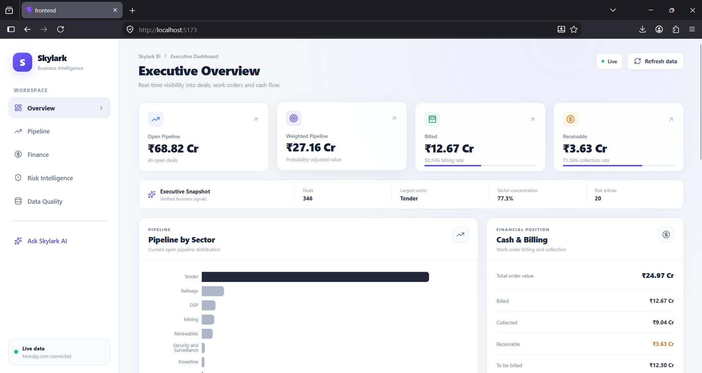
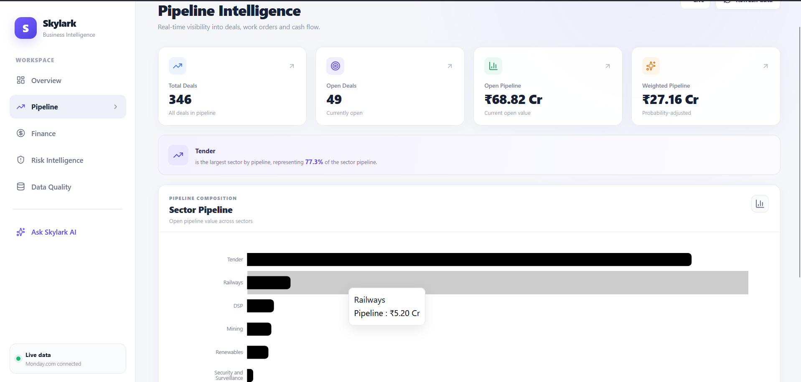
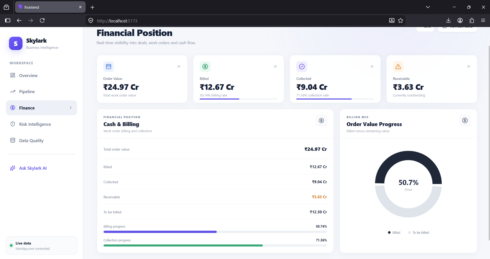
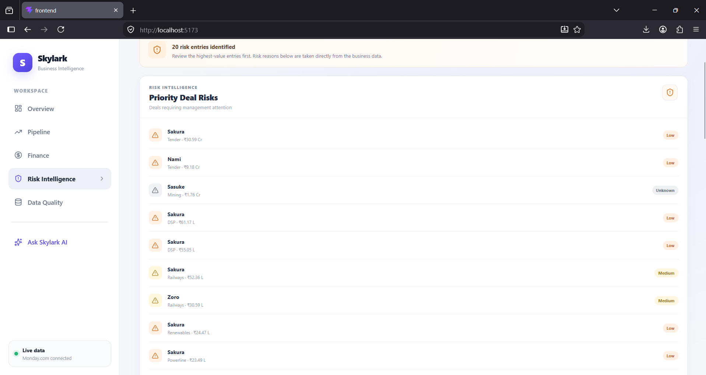
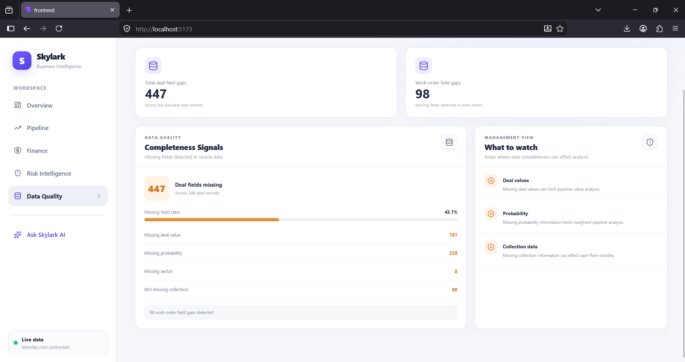
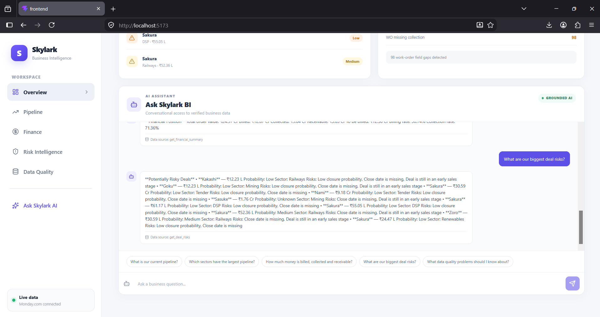
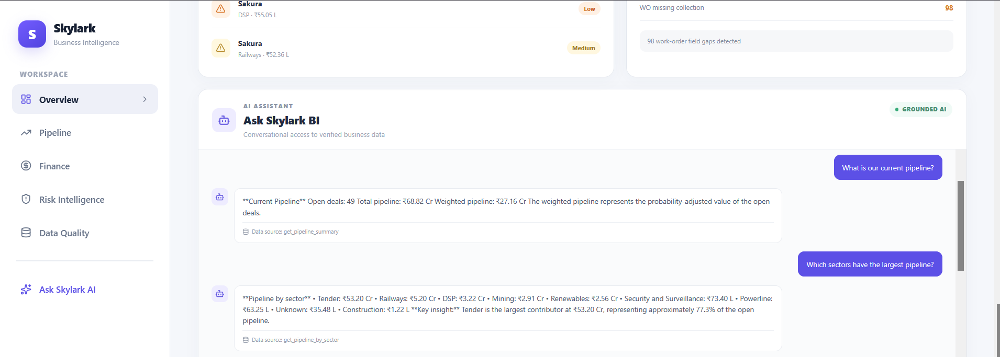
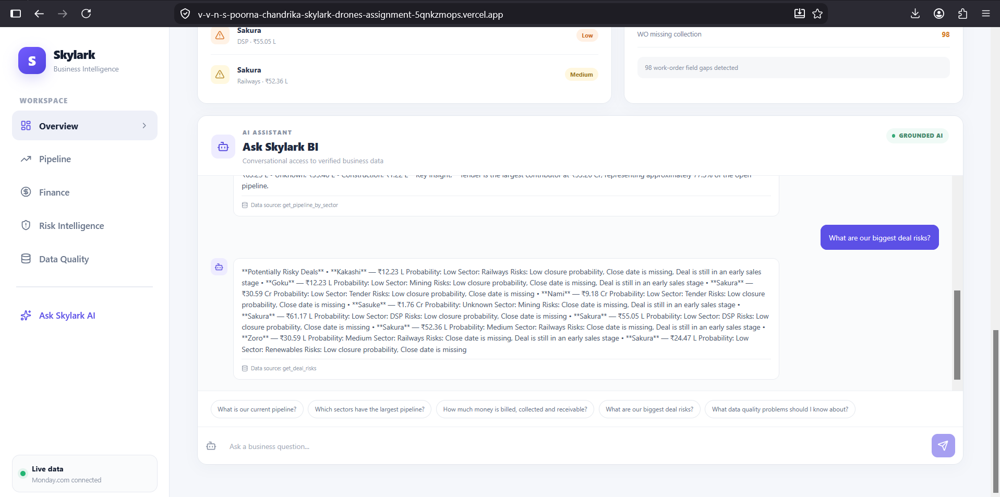

# Skylark BI Agent

> **AI-powered Business Intelligence platform for turning operational data into actionable executive insights.**

**🔗 Live Demo:** https://v-v-n-s-poorna-chandrika-skylark-drones-assignment-5qnkzmops.vercel.app/

**📄 Decision Log:** [View Decision Log](decision-log.pdf)

Skylark BI Agent is a full-stack Business Intelligence application that combines **business analytics, financial intelligence, deal-risk detection, data-quality monitoring, and a grounded AI assistant** into one executive dashboard.

Instead of manually navigating spreadsheets and dashboards, users can ask natural-language questions about the business and receive answers grounded in the application's analytics layer.

## ✨ Key Highlights

| Capability | Description |
|---|---|
| 📊 **Executive Dashboard** | High-level view of pipeline, weighted pipeline, billing, collections and receivables |
| 📈 **Pipeline Intelligence** | Analyze open deals and pipeline distribution across sectors |
| 💰 **Financial Intelligence** | Track order value, billing, collections and receivables |
| ⚠️ **Risk Intelligence** | Identify deals requiring management attention |
| 🧹 **Data Quality** | Detect missing fields that may affect business analysis |
| 🤖 **AI Assistant** | Ask business questions using natural language |
| 🔗 **Monday.com Integration** | Retrieve operational business data |
| 🔄 **Live Refresh** | Refresh dashboard analytics from the backend |
| 🖥️ **Modern UI** | Responsive React-based executive dashboard |

---

## 🎯 Problem

Business teams often have valuable operational data spread across multiple sources.

Although the data exists, answering basic management questions can still require:

- Manually inspecting records
- Calculating financial metrics
- Filtering deals
- Identifying risky opportunities
- Checking data completeness
- Navigating multiple systems

This creates unnecessary friction between **raw business data and management decisions**.

---

## 💡 Solution

Skylark provides a unified intelligence layer that transforms operational data into actionable business insights.

```text
Business Data
      ↓
Data Normalization
      ↓
Analytics Layer
      ↓
Business Intelligence
      ↓
AI Agent
      ↓
Executive Decision
```

The platform allows users to monitor business performance, understand financial position, identify deal risks, investigate data-quality issues and interact with the data conversationally.

---

# 🤖 AI-Powered Business Assistant

The Skylark AI Assistant provides a conversational interface over the business analytics layer.

The assistant combines **deterministic business tools** with an **LLM-powered reasoning layer** to answer natural-language questions while keeping critical business metrics grounded in the underlying data.

### LLM Architecture

The application uses:

- **Qwen2.5 1.5B** as the language model
- **Ollama** for local model serving and inference
- **FastAPI** as the backend API layer
- Python-based BI tools for retrieving verified business metrics
- Prompt-based intent classification and management summarization

```text
User Question
      │
      ▼
Intent Detection
      │
      ├── Pipeline ───────► Pipeline Tool
      ├── Sector ─────────► Sector Tool
      ├── Finance ────────► Finance Tool
      ├── Receivables ────► Receivables Tool
      ├── Risk ───────────► Risk Tool
      ├── Data Quality ───► Data Quality Tool
      │
      └── Management ─────► Multiple BI Tools
                                │
                                ▼
                         Verified Fact Sheet
                                │
                                ▼
                         Qwen2.5 1.5B
                                │
                                ▼
                       Executive Briefing
The assistant retrieves relevant business information through the application's analytics and tool layer before generating its response.

Grounded AI Responses

Critical business metrics are calculated by the Python analytics layer before being presented to the LLM.

This prevents the model from independently calculating or inventing business figures.

For management-level questions, the system collects verified information from:

Pipeline analytics
Sector analytics
Financial analytics
Receivables
Deal-risk detection
Data-quality analysis

These values are assembled into a verified business fact sheet, which is then provided to the LLM to generate a concise executive briefing.

Example Questions

What is our current pipeline?

Which sectors have the largest pipeline?

How much money is currently receivable?

What are our biggest deal risks?

Why is a particular deal considered risky?

What data quality problems should I know about?

What should management focus on?

### Example

**User**

> Which deal is the biggest risk?

**Skylark**

```text
Deal: Sakura
Value: ₹30.59 Cr
Probability: Low
Sector: Tender

Risk signals:
• Low closure probability
• Close date is missing
```

This keeps AI responses connected to the application's underlying business data rather than relying only on generic model knowledge.

---

# 📊 Core Intelligence Modules

## 1. Executive Overview

The main dashboard provides an executive-level snapshot of the business.

Key indicators include:

- Open Pipeline
- Weighted Pipeline
- Total Deals
- Billing Rate
- Collection Rate
- Receivables
- Sector Concentration
- Priority Deal Risks
- Data Quality Signals

---

## 2. Pipeline Intelligence

The Pipeline module provides visibility into the current sales pipeline.

It includes:

- Total deals
- Open deals
- Open pipeline
- Weighted pipeline
- Pipeline by sector
- Sector concentration

The weighted pipeline provides a probability-adjusted view of potential business value.

### Pipeline Analysis

```text
Total Pipeline
      │
      ├── Sector A
      ├── Sector B
      ├── Sector C
      └── ...
      
Weighted Pipeline
      │
      └── Probability-adjusted opportunity value
```

---

## 3. Financial Intelligence

The Finance module provides visibility into the movement from work-order value to cash collection.

```text
Total Order Value
        │
        ▼
      Billed
        │
        ▼
    Collected
```

The dashboard also tracks:

```text
Receivable
To Be Billed
```

Key metrics include:

- Total Order Value
- Billed Amount
- Collected Amount
- Receivable
- Amount To Be Billed
- Billing Rate
- Collection Rate

---

## 4. Risk Intelligence

The Risk Intelligence module identifies deals that may require management attention.

Risk signals can include:

- Low closure probability
- Missing close dates
- Early sales stages
- Unknown probability
- Other risk indicators generated by the analytics layer

The system prioritizes risk entries so that high-value opportunities can be reviewed first.

### Risk Detection Concept

```text
Low Probability
       +
Missing Close Date
       +
Early Sales Stage
       ↓
Potential Risk
       ↓
Management Attention
```

Each risk entry can include the deal name, value, sector, probability and detected risk reasons.

---

## 5. Data Quality Intelligence

Reliable analytics depends on reliable source data.

The Data Quality module identifies missing business information that can affect analytical accuracy.

Examples include:

- Missing deal values
- Missing probabilities
- Missing sectors
- Missing work-order collection information

The dashboard provides both aggregate field-gap counts and specific completeness signals.

---

# 🏗️ System Architecture

```text
                         ┌─────────────────────┐
                         │     Business User   │
                         │     / Executive     │
                         └──────────┬──────────┘
                                    │
                                    ▼
                         ┌─────────────────────┐
                         │    React Frontend   │
                         │                     │
                         │ Executive Overview  │
                         │ Pipeline            │
                         │ Finance             │
                         │ Risk Intelligence   │
                         │ Data Quality        │
                         │ AI Assistant        │
                         └──────────┬──────────┘
                                    │
                                  REST
                                    │
                                    ▼
                         ┌─────────────────────┐
                         │     FastAPI API     │
                         │                     │
                         │ /analytics/dashboard│
                         │ /chat               │
                         └──────────┬──────────┘
                                    │
              ┌─────────────────────┼─────────────────────┐
              │                     │                     │
              ▼                     ▼                     ▼
      ┌──────────────┐      ┌──────────────┐      ┌──────────────┐
      │  Analytics   │      │  AI Agent    │      │  Monday.com  │
      │    Layer     │      │    Layer     │      │    Client    │
      └──────┬───────┘      └──────────────┘      └──────┬───────┘
             │                                            │
             ▼                                            ▼
      ┌──────────────┐                            Business Data
      │ Pipeline     │
      │ Finance      │
      │ Risk         │
      │ Operations   │
      │ Data Quality │
      └──────────────┘
```

---

# 🔄 Data Flow

```text
                    Monday.com / Business Data
                              │
                              ▼
                     Data Normalization
                              │
                              ▼
                    ┌──────────────────┐
                    │ Analytics Layer  │
                    └────────┬─────────┘
                             │
              ┌──────────────┼──────────────┐
              ▼              ▼              ▼
          Pipeline        Finance          Risk
              │              │              │
              └──────────────┼──────────────┘
                             ▼
                       Data Quality
                             │
                             ▼
                         AI Agent
                             │
                             ▼
                     Executive Dashboard
```

---
# 📸 Application Screenshots

Skylark provides dedicated views for executive monitoring, business analytics and conversational decision support.

### Executive Dashboard



The executive overview provides a consolidated view of pipeline, weighted pipeline, billing, collections, receivables, sector concentration, deal risks and data-quality signals.

### Pipeline Intelligence



The Pipeline Intelligence view provides visibility into open deals, total pipeline, weighted pipeline and pipeline distribution across sectors.

### Financial Intelligence



The Finance view tracks total order value, billed amount, collected amount, receivables, amount to be billed and billing/collection progress.

### Risk Intelligence



The Risk Intelligence view highlights deals requiring management attention and provides risk reasons such as low closure probability, missing close dates and early sales stages.

### Data Quality



The Data Quality view identifies missing business fields that may affect pipeline, financial and analytical accuracy.

### AI Business Assistant



The Skylark AI Assistant provides a conversational interface for querying verified business information through natural-language questions.

### AI-Powered Pipeline Analysis



The AI assistant can retrieve and explain pipeline information, including current pipeline value, weighted pipeline and sector-level distribution.

### AI-Powered Risk Analysis



The AI assistant can investigate deal risks and explain why specific opportunities require management attention using signals from the analytics layer.

# 🛠️ Technology Stack

### Frontend

- React
- Vite
- JavaScript
- Recharts
- Lucide React
- CSS

### Backend

- Python
- FastAPI
- REST APIs
- Modular analytics services

### AI / Agent Layer

- **Qwen2.5 1.5B** Large Language Model
- **Ollama** for local LLM inference
- Intent classification for natural-language business queries
- Tool-based Business Intelligence retrieval
- Deterministic analytics for critical business metrics
- LLM-powered management briefings
- Structured JSON responses for intent classification
- Prompt-driven response generation
- Grounded responses based on verified business data

### Integration & Data

- Monday.com API integration
- Data normalization
- Pipeline analytics
- Financial analytics
- Risk analytics
- Data-quality analytics

---

# 📁 Project Structure

```text
skylark-bi-agent/
│
├── backend/
│   ├── app/
│   │   ├── agent/
│   │   ├── analytics/
│   │   ├── data/
│   │   ├── monday/
│   │   ├── config.py
│   │   └── main.py
│   │
│   ├── requirements.txt
│   └── .env
│
├── data/
│
├── frontend/
│   └── ...
│
├── public/
│
├── src/
│
├── screenshots/
│   ├── ai-assistant.png
│   ├── ai-assistant-2.png
│   ├── ai-assistant-3.png
│   ├── data-quality.png
│   ├── finance.png
│   ├── overview.png
│   ├── pipeline.png
│   └── risk.png
│
├── .gitignore
├── decision-log.pdf
├── index.html
├── package.json
├── package-lock.json
├── README.md
└── vite.config.js
```

---

# 🌐 Hosted Prototype

The application is deployed as a production-ready web prototype and can be tested without local setup.

**Frontend / Application:**

https://v-v-n-s-poorna-chandrika-skylark-drones-assignment-5qnkzmops.vercel.app/

The hosted prototype provides access to:

- Executive Overview
- Pipeline Intelligence
- Financial Intelligence
- Risk Intelligence
- Data Quality
- Conversational AI Assistant

The frontend communicates with the deployed FastAPI backend through REST APIs.

# 🚀 Getting Started

## Prerequisites

Make sure the following are installed:

- Python 3.10+
- Node.js 18+
- npm
- Git

---

## 1. Clone the Repository

```bash
git clone https://github.com/poornachandrika31/V-V-N-S-POORNA-CHANDRIKA_SKYLARK-DRONES-ASSIGNMENT-.git

cd V-V-N-S-POORNA-CHANDRIKA_SKYLARK-DRONES-ASSIGNMENT-
```

---

## 2. Backend Setup

Navigate to the backend:

```bash
cd backend
```

Create a virtual environment:

### Windows

```powershell
python -m venv venv
venv\Scripts\activate
```

### macOS / Linux

```bash
python3 -m venv venv
source venv/bin/activate
```

Install dependencies:

```bash
pip install -r requirements.txt
```

---

## 3. Configure Environment Variables

Create a `.env` file inside the `backend` directory.

Add the required credentials and configuration values for the business-data integration and AI services.

**Do not commit API keys, credentials or `.env` files to GitHub.**

---

## 4. Start the Backend

From the `backend` directory:

```bash
uvicorn app.main:app --reload --host 127.0.0.1 --port 8000
```

The backend will run at:

```text
http://127.0.0.1:8000
```

FastAPI documentation:

```text
http://127.0.0.1:8000/docs
```

---

## 5. Start the Frontend

Open another terminal:

```bash
cd frontend
```

Install dependencies:

```bash
npm install
```

Start the development server:

```bash
npm run dev
```

Vite will display the local frontend URL in the terminal.

---

# 🔌 API Overview

## Dashboard

```http
GET /analytics/dashboard
```

Returns the consolidated analytics required by the executive dashboard.

The response includes information such as:

```text
pipeline
finance
pipeline_by_sector
risks
data_quality
```

---

## AI Chat

```http
POST /chat
```

Example request:

```json
{
  "message": "What is our current receivable?"
}
```

The backend processes the request through the AI and analytics layers and returns a grounded business response.

---

# 💬 Example Questions

### Pipeline

```text
What is our current pipeline?
```

```text
Which sectors have the largest pipeline?
```

```text
What is our weighted pipeline?
```

### Finance

```text
What is our billing rate?
```

```text
How much money is currently receivable?
```

```text
How much has been collected?
```

### Risk

```text
Show me risky deals.
```

```text
Which deal is the biggest risk?
```

```text
Why is Sakura considered risky?
```

### Data Quality

```text
What data quality problems should I know about?
```

---

# 🔐 Security

Sensitive configuration should be stored using environment variables.

The repository excludes common local and sensitive files such as:

```text
.env
venv/
.venv/
node_modules/
dist/
```

API keys, authentication credentials and private integration tokens should never be committed to source control.

---

# 📈 Design Philosophy

Skylark is built around three principles.

### 01 — Clarity

Executives should understand the business situation quickly without navigating through multiple systems.

### 02 — Actionability

The platform should highlight important signals and potential issues rather than simply displaying raw data.

### 03 — Trust

AI responses should remain grounded in the application's business data and analytics layer.

---

# 🌟 Why Skylark?

Traditional BI dashboards primarily answer:

> **What happened?**

Skylark aims to move one step further:

> **What is happening, why does it matter, and what should I look at next?**

By combining structured analytics with a conversational AI interface, Skylark provides a more accessible way for business users to interact with operational data.

---

# ✅ Assignment Requirements

| Requirement | Implementation |
|---|---|
| Hosted Prototype | Deployed React application accessible through Vercel |
| Conversational Interface | AI-powered `/chat` endpoint with business-data grounding |
| Monday.com Integration | FastAPI-based Monday.com API client |
| Business Analytics | Pipeline, finance, operations and risk analytics |
| Data Quality | Missing-field and data-completeness detection |
| Error Handling | API exception handling and graceful failure responses |
| Decision Log | Included in `docs/decision-log.pdf` |
| Source Code | Complete frontend and backend source included |
| README | Architecture, setup, API and Monday.com configuration documented |

---


# 📚 Project Information

**Project:** Skylark BI Agent

**Organization:** Skylark Drones

**Application Type:** AI-powered Business Intelligence Platform

**Architecture:** Full-stack React + FastAPI application

# 📋 Decision Log

The project includes a concise decision log documenting the key assumptions, architectural and technical trade-offs, interpretation of "leadership updates", and potential improvements with additional development time.

📄 **[Read the Decision Log](docs/decision-log.pdf)**

---

# 👩‍💻 Author

**V. V. N. S. Poorna Chandrika**

Computer Science & Artificial Intelligence

---

## ⭐ Acknowledgements

Built as part of the **Skylark Drones assignment**, focusing on business intelligence, analytics, AI-assisted decision support and full-stack application development.

---

> **Skylark BI Agent — From business data to better decisions.**